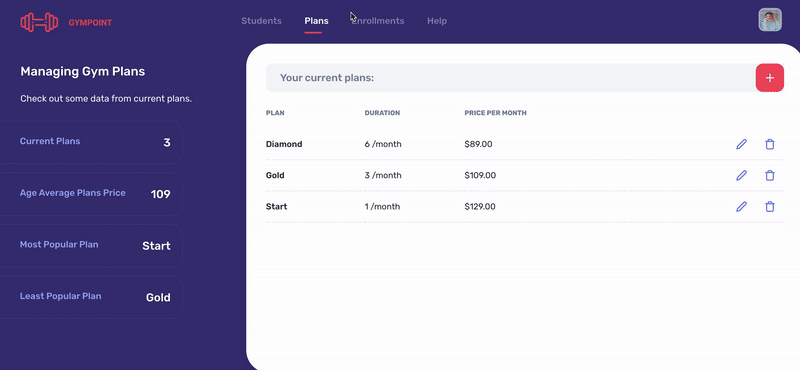

<h1>
  GymPoint
</h1>

A simple project to manage gym, representing my journey in learning NodeJS while implementing ReactJS and React Native. Still under development.

 <p>
   
   
   
</p>

## Screenshots



## Browser Support

|  |  |  |  |  |
| ------------------------------------------------------------------------------------------------------------- | -------------------------------------------------------------------------------------------------------------- | ------------------------------------------------------------------------------------------------------------ | ------------------------------------------------------------------------------------------------------------- | --------------------------------------------------------------------------------------------------------- |
| 39+ ✔                                                                                                         | 42+ ✔                                                                                                          | 29+ ✔                                                                                                        | 10.1+ ✔                                                                                                       | Nope ✘                                                                                                    |

## :information_source: Getting Started

These instructions will get you a copy of the project up and running on your local machine for development purposes.

You will need:

- NodeJS | Yarn or Npm | Docker | PostgreSQL | Redis

You need to install these prerequisites on your computer before you can use "**GymPoint**".

<h4>NodeJS</h4> <a href="https://nodejs.org/en/download/package-manager/" target="_blank">with these instructions</a>.

<h4>Yarn</h4> <a href="https://yarnpkg.com/en/docs/getting-started" target="_blank">with these instructions</a>.

<h4>Docker</h4> <a href="https://www.docker.com/get-started" target="_blank">with these instructions</a>.

<h4>PostgreSQL</h4> <a href="https://hub.docker.com/_/postgres" target="_blank">with these instructions</a>.

```bash
# Docker
$ docker run --name gympoint -e POSTGRES_USER=postgres -e POSTGRES_PASSWORD=docker -p 5432:5432 -d postgres

# Go into the repository
$ cd gym-point

# Install dependencies
$ yarn install

# Create the migrations
$ yarn sequelize db:migrate

# Sync admin user seeders
$ yarn sequelize db:seed:all

# Run the Rest API
$ yarn dev

```

<h4>REST API Client</h4>

Finally, you will need a rest client to test "**GymPoint**". Here are some:

<ul>
  <li><a href="https://insomnia.rest/" target="_blank">Insomnia</a></li>
  <li><a href="https://www.getpostman.com/" target="_blank">Postman</a></li>
</ul>

## :rocket: Built With

- [NodJS](https://nodejs.org/en/)
- [Docker](https://www.docker.com/)
- [PostgreSQL](https://www.postgresql.org/)
- [Redis](https://redis.io/)
- [PostgreSQL](https://www.postgresql.org/)
- [Expo](https://expo.io/)
- [React-Native](https://facebook.github.io/react-native/)
- [React Native Gesture Handler](https://kmagiera.github.io/react-native-gesture-handler/)
- [React Navigation](https://reactnavigation.org/)
- [Redux](https://redux.js.org/)
- [PropTypes](https://github.com/facebook/prop-types)

## Tools

<ul>
  <li>es6 syntax and babel</li>
  <li>Sucrase + Nodemon;</li>
  <li>ESLint + Prettier + EditorConfig;</li>
  <li>Sequelize (PostgreSQL)</li>
  <li>Flux to organize the data flow management</li>
</ul>

## What's next

- [ ] REST API (with Node js) - tests
- [ ] iOS & Android Apps (based on react-native)
- [ ] Website App in any browser (based on react)

---

Made with ♥ by Dana Rocha :wave: [Get in touch!](https://www.linkedin.com/in/danarocha/)

## License

This project is licensed under the MIT License - see the <a href="" target="_blank">LICENSE.md</a> file for details.
